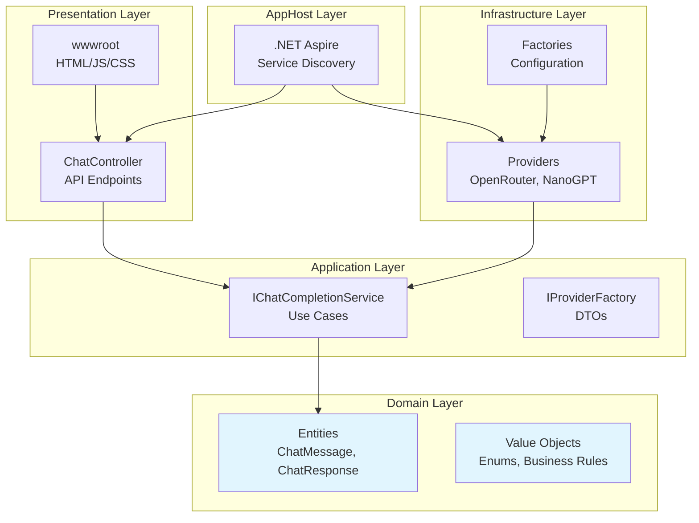

# ChatCompletionService - Enterprise AI Chat Application

This project is a continuation of the AI chat application ChatCompletionService https://github.com/stefjnl/ChatCompletionService. Built with .NET 8, Clean Architecture, and .NET Aspire. It provides a unified interface for interacting with multiple AI providers while maintaining a clean, scalable, and maintainable codebase.

## Architecture Overview

The application follows the principles of Clean Architecture, ensuring a clear separation of concerns and a dependency flow that points inward towards the domain core.



### Layers

-   **Domain**: Contains the core business logic, entities, and rules. It has no external dependencies.
-   **Application**: Defines the application's use cases and interfaces. It depends only on the Domain layer.
-   **Infrastructure**: Implements the interfaces defined in the Application layer. It handles external concerns like AI provider APIs, databases, etc.
-   **API**: The presentation layer, which exposes the application's functionality via a RESTful API.
-   **AppHost**: The .NET Aspire orchestration project for managing services during local development.

## Features

-   **Provider Abstraction**: Easily switch between different AI providers (OpenRouter, NanoGPT) via the UI.
-   **Streaming Chat**: Real-time, token-by-token response streaming using Server-Sent Events (SSE).
-   **Clean Architecture**: A well-structured and maintainable codebase following SOLID and DRY principles.
-   **.NET Aspire Orchestration**: Simplified local development and debugging experience with the Aspire dashboard.
-   **Vanilla JS Frontend**: A lightweight, framework-free frontend for simplicity and performance.

## Getting Started

### Prerequisites

-   .NET 9 SDK
-   An IDE like Visual Studio or VS Code.

### Setup

1.  **Clone the repository:**
    ```bash
    git clone <repository-url>
    cd ChatCompletionService
    ```

2.  **Configure API Keys:**
    This project uses User Secrets to manage API keys.
    -   Navigate to the API project directory: `cd ChatCompletionService.API`
    -   Initialize user secrets: `dotnet user-secrets init`
    -   Set your API keys:
        ```bash
        dotnet user-secrets set "Providers:OpenRouter:ApiKey" "YOUR_OPENROUTER_KEY"
        dotnet user-secrets set "Providers:NanoGPT:ApiKey" "YOUR_NANOGPT_KEY"
        ```

### Running the Application

1.  Set the `ChatCompletionService.AppHost` project as the startup project.
2.  Run the application (e.g., by pressing F5 in Visual Studio or using `dotnet run` in the `AppHost` directory).
3.  The .NET Aspire dashboard will launch. Find the URL for the `apiservice` and navigate to it in your browser to use the application.

## Future Enhancements (Phase 2)

-   Semantic Kernel integration for function calling and orchestration.
-   Conversation persistence to a database.
-   User authentication and authorization.
-   Unit and integration tests.
