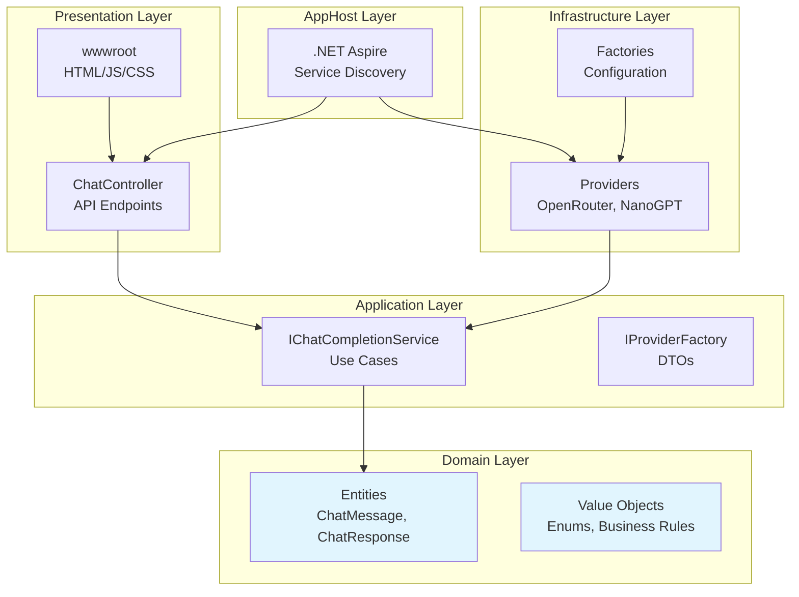
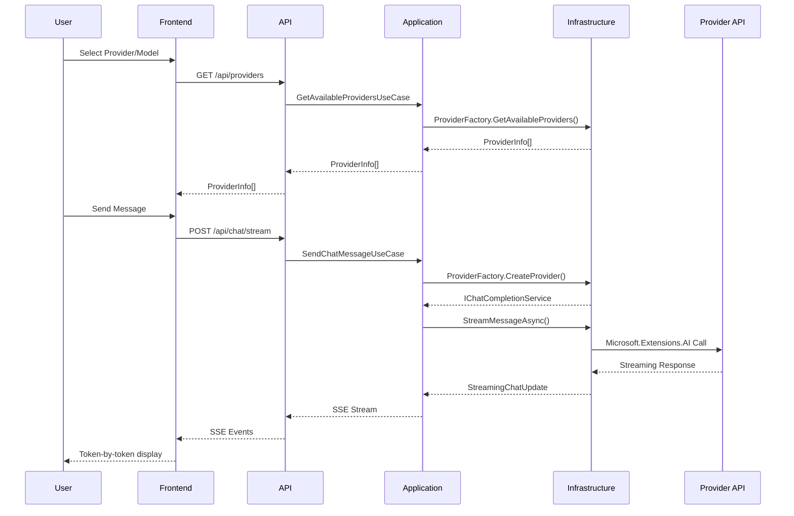

Based on the PRD.md and refined feedback, here's the complete implementation plan for the ChatCompletionService Phase 1 MVP.

## Detailed Implementation Plan

### Overview
This plan implements a Clean Architecture .NET 9 application with Microsoft.Extensions.AI integration, .NET Aspire orchestration, and a vanilla JavaScript frontend. The focus is on provider abstraction, streaming chat, and scalability for Phase 2.

### Architecture Diagram


### Key Implementation Notes
- **Clean Architecture**: Strict layer separation with dependencies pointing inward
- **Microsoft.Extensions.AI**: Used in Infrastructure layer only, abstracted behind Application interfaces
- **Streaming**: Server-Sent Events (SSE) for real-time token streaming
- **Configuration**: Externalized in appsettings.json with user secrets for API keys
- **Frontend**: Vanilla JS with Tailwind CSS, no frameworks for Phase 1 simplicity
- **Testing**: Manual testing through Aspire dashboard, unit tests deferred to Phase 2

### Workflow Diagram


### Dependency Direction
```
API → Application → Domain
       ↑
 Infrastructure
       ↑
    AppHost
```

### Configuration
@/src/ChatCompletionService.API/appsettings.Development.json contains provider endpoints and models (non-sensitive):

  "Providers": {
    "OpenRouter": {
      "Endpoint": "https://openrouter.ai/api/v1/",
      "Models": [
        {
          "Id": "google/gemini-2.5-flash-lite-preview-09-2025",
          "DisplayName": "Google: Gemini 2.5 Flash Lite"
        }
      ]
    },
    "NanoGPT": {
      "Endpoint": "https://api.nanogpt.com/v1/chat/completions",
      "Models": [
        {
          "Id": "z-ai/glm-4.6",
          "DisplayName": "GLM 4.6"
        },
        {
          "Id": "moonshotai/Kimi-K2-Instruct-0905",
          "DisplayName": "Kimi K2 0905"
        },
        {
          "Id": "deepseek-ai/deepseek-v3.2-exp",
          "DisplayName": "DeepSeek V3.2 Exp"
        }
      ]
    }
  }

@/src/.env contains the API keys (sensitive)


### Revised Timeline (35 Todos)
- **Week 1 (Setup - 9 todos)**: Solution setup, Domain models, Application layer skeleton
- **Week 2 (Infrastructure - 8 todos)**: Providers, conversions, configuration, testing
- **Week 3 (API + Aspire - 10 todos)**: Controllers, endpoints, streaming, orchestration
- **Week 4 (Frontend + Polish - 8 todos)**: UI, integration testing, documentation

### Todo List

**Week 1: Setup (9 todos)**
1. Create .NET 9 solution with 5 projects (Domain, Application, Infrastructure, API, AppHost)
2. Set up project references following Clean Architecture dependency flow (API→Application→Domain, Infrastructure→Application, AppHost→API/Infrastructure)
3. Add NuGet packages to each project (Microsoft.Extensions.AI, Aspire.Hosting, etc.)
4. Create Domain entities (ChatMessage, ChatResponse, ConversationContext)
5. Create Domain enums (ChatRole, ProviderType, MessageType)
6. Create Domain value objects (ModelConfiguration, ProviderMetadata) with validation rules
7. Create Application interfaces (IChatCompletionService, IProviderFactory, IModelConfigurationService)
8. Create Application DTOs (ChatRequestDto, ChatResponseDto, ModelInfoDto, ProviderInfoDto)
9. Create Application use cases (SendChatMessageUseCase, GetAvailableProvidersUseCase, GetProviderModelsUseCase)

**Week 2: Infrastructure (8 todos)**
10. Create model conversion utilities between Domain models and Microsoft.Extensions.AI types
11. Implement OpenRouterChatProvider with Microsoft.Extensions.AI IChatClient
12. Implement NanoGptChatProvider with Microsoft.Extensions.AI IChatClient
13. Create ChatProviderFactory for provider instantiation and model retrieval
14. Create ProviderConfigurationManager for reading configuration
15. Define appsettings.json structure for providers (OpenRouter, NanoGPT) with API keys and models
16. Set up user secrets for API keys in development
17. Test providers in isolation (console test or basic verification)

**Week 3: API + Aspire (10 todos)**
18. Create ChatController skeleton with basic structure
19. Implement GET /api/providers endpoint
20. Implement GET /api/providers/{id}/models endpoint
21. Implement POST /api/chat/send (non-streaming) endpoint
22. Implement SSE endpoint structure for /api/chat/stream
23. Integrate provider streaming with SSE response writing
24. Add basic exception handling in API layer with standardized error responses and logging
25. Configure CORS in API project for development (AllowAnyOrigin) and prepare for production
26. Configure AppHost with API service registration and configuration propagation
27. Test API endpoints via Aspire dashboard

**Week 4: Frontend + Polish (8 todos)**
28. Create HTML structure in wwwroot (index.html) with provider/model selector dropdowns
29. Implement frontend JavaScript for loading providers and models via API calls (cascading dropdowns)
30. Build chat interface with message display, input textarea, send button, and clear conversation functionality
31. Implement client-side streaming using EventSource API for token-by-token display
32. Add client-side state management for conversation history, provider/model selection, and localStorage persistence
33. Style frontend with Tailwind CSS for clean, responsive UI (user/assistant message alignment, loading indicators)
34. Test end-to-end flow (provider switching, model selection, streaming chat with both providers)
35. Create README.md with architecture diagram, setup instructions, and demo guidance

### Success Criteria
- All 35 todos completed
- Provider switching and streaming work seamlessly
- Clean Architecture maintained (no layer violations)
- Application runs via .NET Aspire dashboard
- Ready for Phase 2 enhancements

### Key Points to Remember During Implementation
**Microsoft.Extensions.AI Usage:**
- Only in Infrastructure layer
- Never exposed to Application/Domain
- Wrapped behind `IChatCompletionService`

**Testing Strategy (Phase 1):**
- Manual testing via Aspire dashboard
- Verify both providers work
- Verify streaming works
- Save automated tests for Phase 2

**When You Get Stuck:**
- Reference the PRD sections
- Check the workflow diagram
- Ensure you're not violating layer boundaries